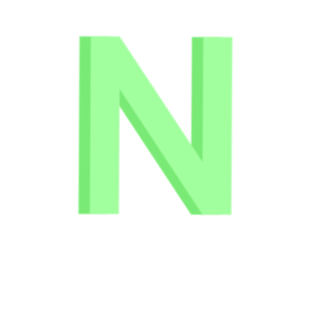
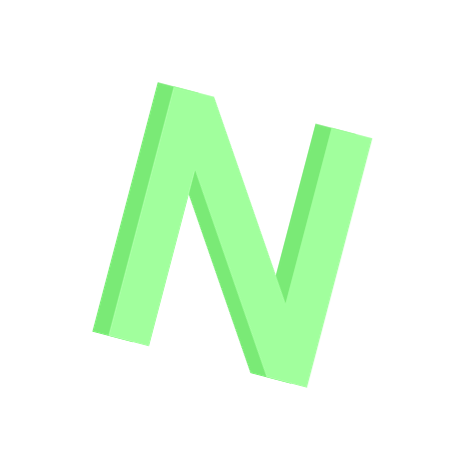
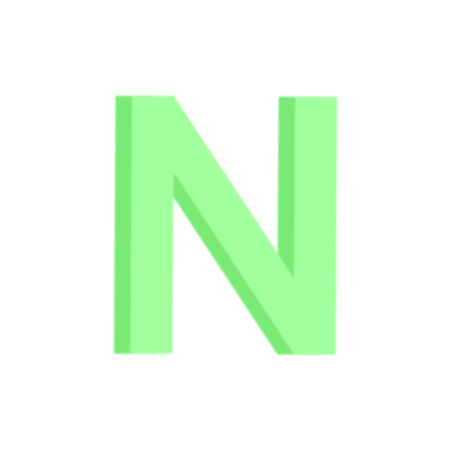

<!DOCTYPE html>
<html lang="en">

    <meta name="viewport" content="width=device-width, initial-scale=1.0">
    <meta charset="UTF-8">
    <title>Nicolas' Portfolio</title>
    <link rel="shortcut icon" href="/Addatives/Nicolas-N.png" type="image/x-icon">
    <link rel="stylesheet" href="style.css">

</html>

<body id="body">
    

        

            
            

                ㅤ
            

        

        
        

        <h1 id="heyNicolas" class="nicText">Hey, I'm ㅤicolas..</h1>
        <h1 id="heyNicolas2" class="nicText2">I'm a Full Stack Developer,</h1>
        <h1 id="heyNicolas3" class="nicText3">Software Developer and YouTuber</h1>

        
        
        
        

        
        

        <textarea id="js" class="js" placeholder="Make sure to open your console! (JavaScript)" spellcheck="false"></textarea>
        <iframe id="code" class="codeFrame"></iframe>

        <button id="suvery" class="survey" onclick="survey()">Survey</button>

        <button type="submit" class="compileButton" id="compileButton" onclick="compileCode()">compile</button>

        
        
        
        
        
        

        <button class="light" onclick="toggleTheme()">Toggle Light Mode</button>
        <button class="dark" onclick="toggleBack()">Toggle Dark Mode</button>

</body>
